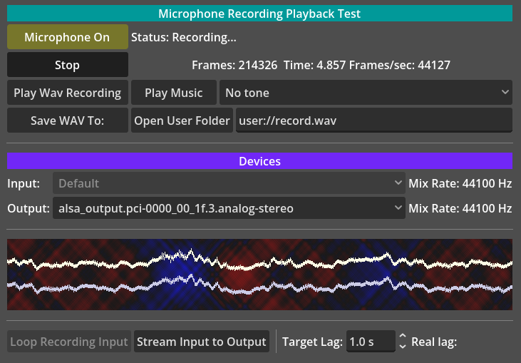

This example project shows two different ways to access the microphone.

Language: GDScript

Renderer: Compatibility

Version: 4.7

Check out this demo on the Asset Store: https://store.godotengine.org/asset/godot-foundation/audio-mic-record-demo/

# MicInput

This scene reads microphone audio input data on a process loop using the
[AudioServer.get_input_frames(frames: int) -> PackedVector2Array](https://docs.godotengine.org/en/stable/classes/class_audioserver.html#class-audioserver-method-get-input-frames) function.

The Microphone is turned on at startup. To change the Input Device
you must to turn it off first.

Play the music to test the speakers are working.

Play the sinusoidal tone (from another device, such as a mobile phone) to experiment with the time displacement on a stereo microphone.

To simulate the common use case of Voice over IP (VoIP) this demo
includes a time delay playback buffer with a changeable lag length when you click on `Stream Input To Output`.
The actual playback buffer aims for the target delay by either pausing or speeding up the playback stream.
An `AudioEffectPitchShift` is used to lower the pitch of the playback to compensate
for the speedup.

To save your voice when testing the system, you can replay a short section of audio on a loop by toggling the button `Loop Recording Input`.

# MicRecord

This scene plays an [AudioStreamMicrophone](https://docs.godotengine.org/en/stable/classes/class_audiostreammicrophone.html) to a muted bus to capture its data using an 
[AudioEffectRecord](https://docs.godotengine.org/en/stable/classes/class_audioeffectrecord.html)
where it can be played back or saved to a file.

## Screenshots

